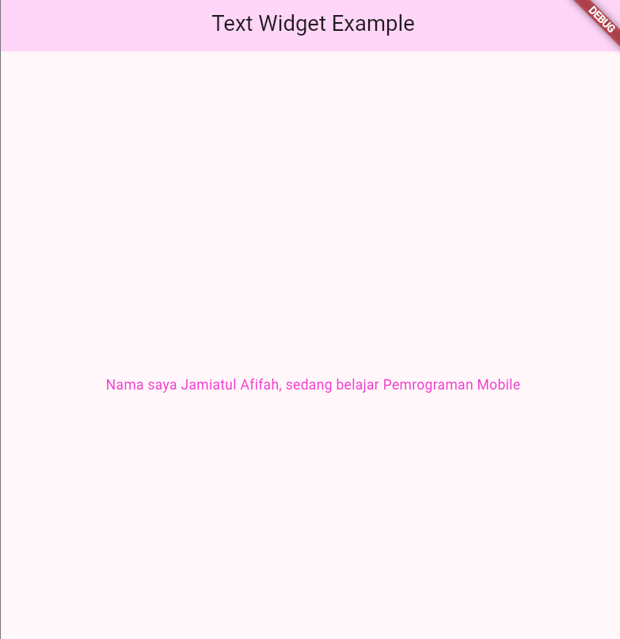

# 🧩 Praktikum 4: Menerapkan Widget Dasar

## 👩‍💻 Langkah 1: Text Widget
Menampilkan teks sederhana menggunakan widget `Text()` pada Flutter.

### 📜 Kode:
```dart
Text(
  "Nama saya Jamiatul Afifah, sedang belajar Pemrograman Mobile",
  style: TextStyle(color: Colors.red, fontSize: 14),
  textAlign: TextAlign.center,
);

